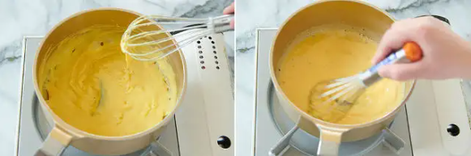
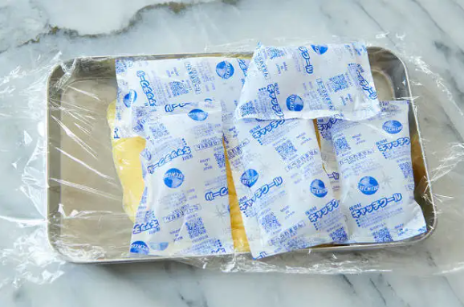
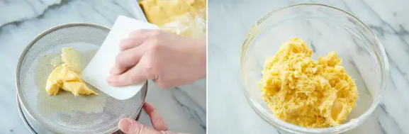
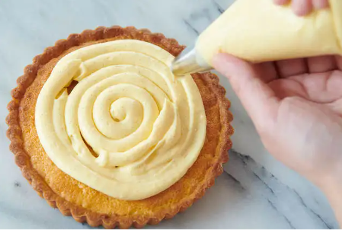

# ディプロマットクリーム

## 材料


| 材料           | 量    | 備考    |
| -------------- | ----- | ------- |
| 卵黄           | 48g   | 約3個分 |
| 牛乳           | 200g  |         |
| グラニュー糖   | 50g   |         |
| 薄力粉         | 9g    |         |
| コーンスターチ | 9g    |         |
| 無塩発酵バター | 20g   |         |
| バニラビーンズ | 1/4本 |         |
| 生クリーム36%  | 60g |         |

## 作り方

1. ふるっておいた粉類（グラニュー糖、薄力粉、コーンスターチ）が入ったボウルの中心に牛乳の一部を入れて混ぜ、卵黄を加えて軽く混ぜる。

    ```
    ポイント
    最初に入れる牛乳は20～50cc程度。最初に水分を加えておくことで、卵黄の塊や粉の塊ができにくくなる。
    ```

1. 残りの牛乳をしっかりと湯気がでる程度まで温める。温めた牛乳を⑲の卵黄に合わせて鍋に移す。

1. 鍋からはみ出ない程度の強火で、しっかりと中心がフツフツするまで煮上げる。

    

    ```
    ポイント
    ・液体が固まりはじめたら、混ぜる速度を上げる。

    ・混ぜている手ごたえが軽くなると、鍋肌からクリームが勝手に剥がれてくる。さらに混ぜ続け沸騰してポコポコと浮いてきたら煮上がりのサイン。
    ```

1. 火から下ろしてバターを加えてしっかり混ぜる。

    ```
    ポイント
    ・ラップとクリームの間にできた気泡は、指で逃がす。

    ・破れないようにラップは2重にかける。
    ```

1. 保冷剤で上下を挟み、ときどき保冷剤をひっくり返しながら15分ほど急冷する。




    ```
    ポイント
    ・菌の繁殖を防ぐため、きちんと中心まで冷えた状態にする。
    ```

1. 氷水に入れたボウルにあてながら、ツノが立つくらいまでしっかりと生クリームを泡立てる。

1. 完全に冷えたカスタードクリームを、カードを使って直角に押すように裏ごし器で漉す。

    

1. ボウルに移し、ホイッパーで軽く混ぜてこなす（なめらかにしていく）。

1. 硬めに泡立てた生クリームを3～4回ほどに分けて混ぜ合わせる。はじめは、生クリームの約3分の1の量を加えて、生クリームの白色が見えなくなるまでホイッパーで思いっきり混ぜる。

1. 2回目以降はホイッパーですくい、ワイヤーの間を通す程度に生クリームをなじませる。

1. 8割程度混ざったら、最後の生クリームを加えてゴムベラに持ち替えクリームを整える。

    

1. 丸口金（直径10mm程度）をつけた絞り袋に、ディプロマットクリームを入れる。

```
ポイント
・絞るまで冷蔵庫で冷やしておく。
```

## いちごの上掛け

1. あらかじめグラニュー糖をかけて混ぜ、ラップして常温で最低30分～1時間程度置いておいた冷凍イチゴと冷凍フランボワーズを、500Wの電子レンジで湯気がでるまで2～3分ほど温める
2. ザルに取り出し、実と汁に分ける。温かい汁の入ったボウルに、氷水でふやかしておいた板ゼラチンの水気を切って加えてゴムベラで混ぜて粗熱を取る

## 組み立て

1. 冷ましたタルト台の上に、ディプロマットクリームを絞る。

    

    ```
    ポイント
    ・クリームを絞るときは、中心から渦を描くように絞る。

    ・クリームはイチゴの重さで多少広がるので、絞る際はタルト台の縁を2cm程度空ける。
    ```

1. イチゴを適当なサイズにカットし、のせる。
1. イチゴの上掛けをハケで塗って、冷蔵する。

    ```
    ポイント
    ・カットしたフルーツの断面に上掛けを塗ることで、乾燥を防ぐことができる。

    ・何度も重ね塗りするとハケ目がつくため、できるだけ一度で塗り切るようにする。
    ```