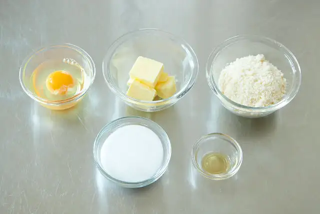
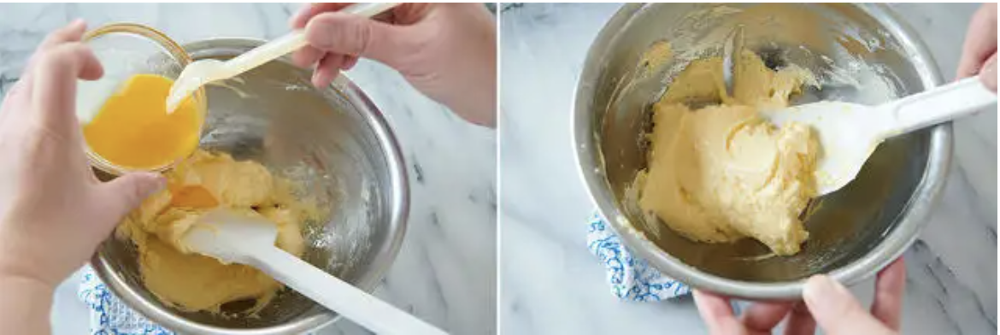

# アーモンドクリーム

## 材料

| 材料               | 量  | 備考 |
| ------------------ | --- | ---- |
| 全卵               | 50g |      |
| 無塩発酵バター     | 50g |      |
| アーモンドパウダー | 50g |      |
| グラニュー糖       | 50g |      |
| ラム酒             | 3g |      |

## 前日準備

### 仕込み

- バターは日の当たらない場所で2時間ほど室温に置き、テカリがでる程度まで柔らかくしておく。（硬いまま使用すると分離しやすくなるため）
- 卵は常温に戻しておく。（冷えたままの卵を使うと、分離しやすくなるため）
- アーモンドパウダーはふるっておく。

### アーモンドクリームを作る

1. テカリがでる程度まで柔らかくしたバターに、グラニュー糖を一度に加えて混ぜる。
1. 常温に戻しておいた卵を溶きほぐし、7～8回にわけて加えて分離させないように混ぜる。ボウルを斜めに傾けて持ち、手応えが重くなったことを確認しながら、ゴムベラで切るように混ぜていく。
  

    ~~~
    ポイント
    ・卵は少しずつ（小さじ1～2程度）加える。
    ・卵が常温に戻っていない場合は、温めた濡れふきんをボウルの下に敷き、数秒温めるとよい。
    ・バターを緩めるより、卵を温めた方が分離しづらい。
    ~~~

1. 一度ふるっておいたアーモンドパウダーを再度ふるいながら一度に加えて、粉っぽさがなくなるまでゴムベラで混ぜる。
1. ラム酒を加えて混ぜ、ラップをして一晩冷蔵庫で休ませる。

## 当日作業

