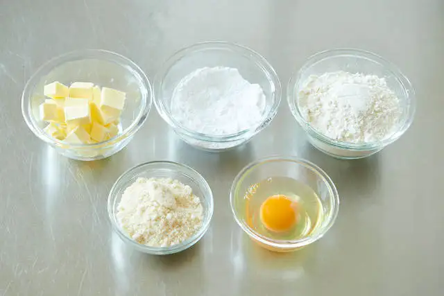

# いちごのタルト

元の記事[リンク](https://www.gnavi.co.jp/dressing/article/22280/)

## タルト生地

### 材料

- 無塩発酵バター … 60g
- 粉糖 … 45g
- 準強力粉 … 100g（今回は『鳥越製粉』の「フランス」を使用）
- アーモンドパウダー … 45g
- 全卵 … 20g

## アーモンドクリーム

## ディプロマットクリーム

