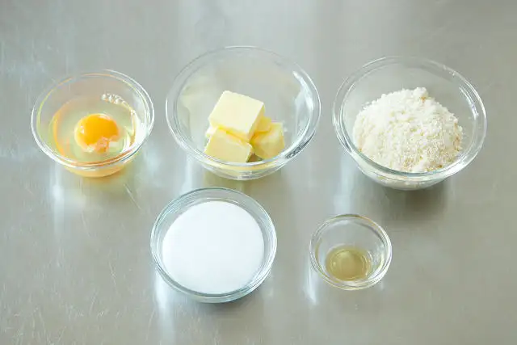

# いちごのタルト

元の記事[リンク](https://www.gnavi.co.jp/dressing/article/22280/)

## 前日準備

- タルト生地を仕込む
- アーモンドクリームを仕込む

## タルト生地

### 材料（※直径16cm、タルト型2台分）

| 材料               | 量   | 備考                                   |
| ------------------ | ---- | -------------------------------------- |
| 無塩発酵バター     | 60g  |                                        |
| 粉糖               | 45g  |                                        |
| 準強力粉           | 100g | 今回は『鳥越製粉』の「フランス」を使用 |
| アーモンドパウダー | 45g  |                                        |
| 全卵               | 20g  |                                        |

### 仕込み

- アーモンドパウダーと粉糖、準強力粉を合わせてふるい、冷凍庫で30分ほど冷やしておく。（粉類が温まっていると、バターの温度が上がって溶けやすくなってしまうため）
- バターは1cm角にカットし、冷蔵庫で30分ほど冷やしておく。 （冷やしすぎると、 粉と合わせたときにバターの粒が残ってしまうため注意）
- 全卵は、溶きほぐして冷たくしておく。

## アーモンドクリーム

### 材料

| 材料               | 量  | 備考 |
| ------------------ | --- | ---- |
| 全卵               | 50g |      |
| 無塩発酵バター     | 50g |      |
| アーモンドパウダー | 50g |      |
| グラニュー糖       | 50g |      |
| ラム酒             | 3g |      |

### 仕込み
- バターは日の当たらない場所で2時間ほど室温に置き、テカリがでる程度まで柔らかくしておく。（硬いまま使用すると分離しやすくなるため）
- 卵は常温に戻しておく。（冷えたままの卵を使うと、分離しやすくなるため）
- アーモンドパウダーはふるっておく。

## ディプロマットクリーム

### 材料

| 材料           | 量    | 備考    |
| -------------- | ----- | ------- |
| 卵黄           | 48g   | 約3個分 |
| 牛乳           | 200g  |         |
| グラニュー糖   | 50g   |         |
| 薄力粉         | 9g    |         |
| コーンスターチ | 9g    |         |
| 無塩発酵バター | 20g   |         |
| バニラビーンズ | 1/4本 |         |
| 生クリーム36%  | 60g |         |

## トッピング

### 材料

| 材料                                         | 量   | 備考 |
| -------------------------------------------- | ---- | ---- |
| いちご                                       | 適量 |      |
| フランボワーズ、ブルーベリー、ブラックベリー | 適量 |      |
| 冷凍いちご                                   | 100g |      |
| 冷凍フランボワーズ                           | 20g  |      |
| グラニュー糖                                 | 20g  |      |
| 板ゼラチン                                   | 1.5g |      |