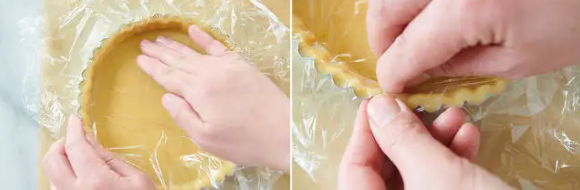

# タルト生地

## 材料（※直径16cm、タルト型2分）


| 材料               | 量   | 備考                                   |
| ------------------ | ---- | -------------------------------------- |
| 無塩発酵バター     | 60g  |                                        |
| 粉糖               | 45g  |                                        |
| 準強力粉           | 100g | 今回は『鳥越製粉』の「フランス」を使用 |
| アーモンドパウダー | 45g  |                                        |
| 全卵               | 20g  |                                        |

## 前日準備

### 仕込み

- アーモンドパウダーと粉糖、準強力粉を合わせてふるい、冷凍庫で30分ほど冷やしておく。（粉類が温まっていると、バターの温度が上がって溶けやすくなってしまうため）
- バターは1cm角にカットし、冷蔵庫で30分ほど冷やしておく。 （冷やしすぎると、 粉と合わせたときにバターの粒が残ってしまうため注意）
- 全卵は、溶きほぐして冷たくしておく。

### タルト生地を作る

1. バターを1cm角にカットし10分程度冷凍する。粉類は合わせ、冷凍庫で30分程冷やす。
2. 粉類の中でバターの粒が見えなくなるまでカードで細かく刻み、手のひらで擦り合わせるように混ぜる。バターと粉が均一に混ざったら中心にくぼみを作り、卵を注ぎカードで手早く混ぜ込む。
3. 生地全体が軽くまとまったらラップに取り出し、2等分してきちんと丸める。

## 当日作業

### タルト台を作る

1. 一晩寝かせた生地をラップで挟み、めん棒で伸ばす

    ```
    ポイント
    ・ラップを使うことで、指の滑りがよくなる。

    ・新しいラップに敷き変えることで、生地にシワができるのを防げる。
    ```

1. ある程度まで生地を伸ばしたら、ルーラーを両サイドに置き、3mmの厚さに伸ばす。扱いやすい硬さになるまで冷蔵庫で生地を休ませる。

    ```
    ポイント
    ・生地を回しながら一方向に伸ばすとキレイな円形に仕上がる。

    ・ラップの上から生地を伸ばすので打ち粉がいらない。

    ・生地を伸ばす際は、ラップと生地が密着していると伸びにくいため、都度ラップを剥がす。
    ```

1. ベーキングシートの上に底取れ式タルト型 を置き、生地を敷きこむ。**この際、底板は使わない。**

    ```
    ポイント
    ・型の縁に生地がかかって切れてしまうのを防ぐため、まず生地を中央に着地させて全体を立ち上げるように型に敷きこむ。
    ```

1. 型の底の角に密着するように生地を合わせる。

    

    ```
    ポイント
    ・生地を一度内側に折りこみ、型の底に直角に入れ込んで戻す。型をまわしながら、一周するまで手早く繰り返す。
    ```

1. 型からはみ出た生地を外側へ広げて、生地の上にラップをかける。めん棒を転がして余った生地を切り落とす。

    

1. 生地にぴったりとラップを貼り付け、型のくぼみに生地を押しつける。

    

    ```
    ポイント
    ・生地が型からはみ出さないように親指で上を押さえながら、指の腹を使って生地を型のくぼみに押しつける。

    ・型をまわしながら、一周するまで繰り返す。
    ```

1. 一周したらバットにのせる。ラップをしたまま冷蔵庫で30分～1時間ほど冷やす。

    ```
    ポイント
    冷やす時間の目安は、ベーキングシートからシルパンに移動できるくらいの硬さになるまで。
    ```
