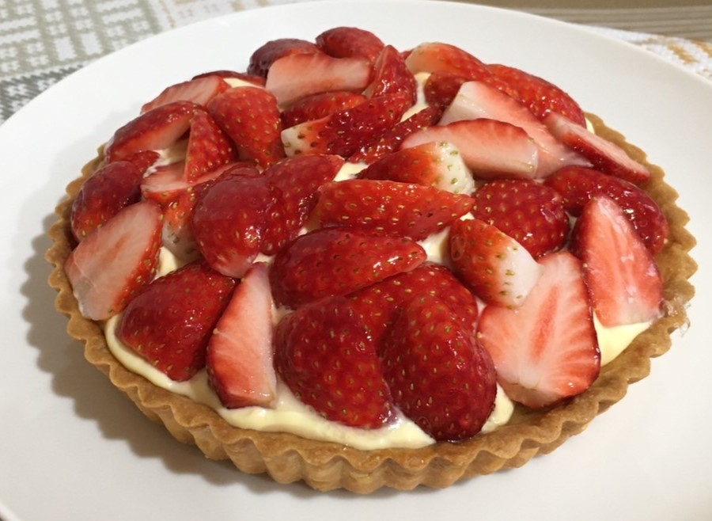
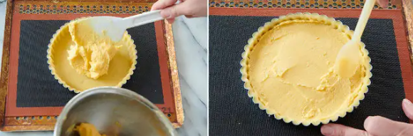
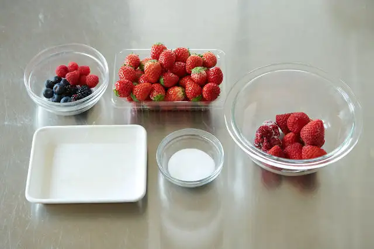

# いちごのタルト



元の記事<a href="[/pages/my-recipe/tart](https://www.gnavi.co.jp/dressing/article/22280/)" target="_blank" rel="noopener noreferrer">
  リンク
</a>

## 前日準備

- タルト生地を仕込む
- アーモンドクリームを仕込む

## タルト生地を作る（前日作業あり）

[タルト生地のレシピ](../tart/index.md)

## アーモンドクリームを作る（前日作業あり）

[アーモンドクリームのレシピ](../almond-cream/index.md)

## タルト生地にアーモンドクリームを詰める



1. ラップを剥がし、生地をベーキングシートから天板に敷いたシルパンの上に移す。

    ```
    ポイント
    ・タルト生地を移動させるときは、勢いよく持ち上げず速やかに移動させる。

    ・底取れタイプの菊皿タルト型を使用するときは、底の板は使わずにシルパンにのせて焼くことで、生地をしっかりと焼くことができる。
    ```

2. タルト生地に、一晩休ませておいたアーモンドクリームをのせる。生地とクリームの隙間を埋めるように、できるだけ平らに詰めていく。

    ```
    ポイント
    ・一晩休ませたアーモンドクリームは、タルト生地に詰める前にゴムベラでこなしておく（なめらかにしておく）。

    ・平らに詰めると、組み立てるときにデコレーションしやすくなる。
    ```

## タルト台を焼き上げる


1. 170～180℃の余熱で温めたオーブンに生地を入れる。
2. 170～180℃で20分程度、天板の奥と手前を入れ変えてさらに3～5分程度焼く。
1. 焼きあがったら、天板から外して網の上で冷ます。

```
ポイント
・使用するオーブンによって焼き時間が多少異なるため、焼き色を見ながら焼く。型と生地の間にわずかに隙間ができたら、中まで焼けている証拠。
```

## ディプロマットクリームを作る

[ディプロマットクリームのレシピ](../diplomat-cream/index.md)

## トッピング

### 材料



| 材料                                         | 量   | 備考 |
| -------------------------------------------- | ---- | ---- |
| いちご                                       | 適量 |      |
| フランボワーズ、ブルーベリー、ブラックベリー | 適量 |      |
| 冷凍いちご                                   | 100g |      |
| 冷凍フランボワーズ                           | 20g  |      |
| グラニュー糖                                 | 20g  |      |
| 板ゼラチン                                   | 1.5g |      |

## いちごの上掛け

1. あらかじめグラニュー糖をかけて混ぜ、ラップして常温で最低30分～1時間程度置いておいた冷凍イチゴと冷凍フランボワーズを、500Wの電子レンジで湯気がでるまで2～3分ほど温める
2. ザルに取り出し、実と汁に分ける。温かい汁の入ったボウルに、氷水でふやかしておいた板ゼラチンの水気を切って加えてゴムベラで混ぜて粗熱を取る

## 組み立て

1. 冷ましたタルト台の上に、ディプロマットクリームを絞る。

    

    ```
    ポイント
    ・クリームを絞るときは、中心から渦を描くように絞る。

    ・クリームはイチゴの重さで多少広がるので、絞る際はタルト台の縁を2cm程度空ける。
    ```

1. イチゴを適当なサイズにカットし、のせる。
1. イチゴの上掛けをハケで塗って、冷蔵する。

    ```
    ポイント
    ・カットしたフルーツの断面に上掛けを塗ることで、乾燥を防ぐことができる。

    ・何度も重ね塗りするとハケ目がつくため、できるだけ一度で塗り切るようにする。
    ```

